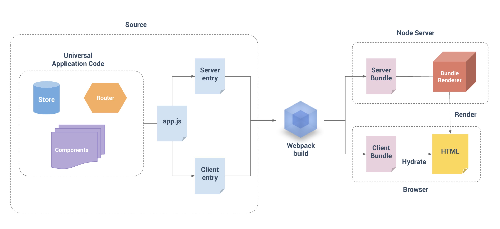

# 基于VUE-SSR 的工程化实践

Node.js Web框架，基于 Koa2

## 前言

> - CSR: client-side-render
> - SSR: server-side-render，服务端渲染，这里理解为同构应用


后端渲染、客户端渲染(CSR)、同构应用(SSR)

> - 后端渲染：服务器直接生成HTML文档并返回给浏览器，但页面交互能力有限。适用于任何后端语言：PHP、Java、Python、GO等。
> - 客户端渲染：页面初始加载的HTML文档中无内容，需要下载执行JS文件，由浏览器动态生成页面，并通过JS进行页面交互事件与状态管理。
> - 同构：isomorphic/universal，基于react、vue框架，客户端渲染和服务器端渲染的结合，在服务器端执行一次，用于实现服务器端渲染（首屏直出），在客户端再执行一次，用于接管页面交互，


## 优点

- SEO优化
- 首屏秒开


## 技术栈

- Nodejs、Koa2
- vue、vue-router、vuex
- ElementUI
- webpack4
- axios
- babel7、eslint
- css、scss、postcss
- pm2
- log4js

## 开始使用

1. 安装 node/npm  Node: >=8
2. clone 模板项目
	```
	git clone https://github.com/mopacha/vue-ssr-admin.git
	```

3. 启动

	```
	npm install
	npm start 
	```

## 目录结构

```bash
vue-ssr-admin
.
├── app.config.js # 端口、代理配置、webpack配置等等
├── babel.config.js # babel配置
├── build
│   ├── webpack.base.config.js # 基本配置 (base config) 
│   ├── webpack.client.config.js # 客户端配置 (client config)
│   └── webpack.server.config.js # 服务器配置 (server config)
├── config
│   ├── default.js # 环境变量配置
│   ├── development.js # 开发环境变量配置
│   └── log4js.js # 日志写入配置
├── eslintrc.conf.js # eslint配置
├── LICENSE
├── package.json
├── package-lock.json
├── pm2.config.js  # 项目pm2配置
├── pm2.md # pm2的api文档
├── postcss.config.js  postcss配置文件
├── public
│   ├── favicon.ico #网站图标
│   └── libs #
├── README.md # 文档
├── server # 服务端代码
│   ├── dev-hot.js # koa2开发模式实现hot热更新
│   ├── index.js # server入口
│   ├── middleware # koa server 中间件
│   ├── server.js # koa2服务详细配置
│   └── ssr.js # vue ssr的koa2中间件。匹配路由、请求接口生成dom，实现SSR
└── src
```

```bash
.src
├── api
│   └── index.js # 接口api
├── app.js  # 通用 entry
├── App.vue
├── assets  # css、images等静态资源目录
├── components # 项目自定义组件目录
├── config.js # vue组件、mixins注册
├── element-ui
│   └── index.js # element ui组件按需加载
├── entry-client.js # 仅运行于浏览器
├── entry-server.js # 仅运行于服务器
├── http
│   ├── getErrMsg.js # 客户端请求错误处理
│   ├── index-client.js # 客户端http 请求封装
│   ├── index-server.js # 服务端http 请求封装
│   └── README.md
├── icons
│   ├── index.js  # svg 图标引入封装
│   ├── svg
│   └── svgo.yml
├── index.template.ejs  # index模板
├── lang  # 国际化语音配置
├── layout # vue 项目模板
├── pages # 业务视图.vue和route路由目录
├── router # 路由route配
├── settings.js
├── store # vuex数据存储目录
├── styles
└── util # 工具目录

```


## 构建

使用 webpack4 来打包我们的 Vue 应用程序。

```bash
├── webpack.base.config.js # 基本配置 (base config) 
├── webpack.client.config.js # 客户端配置 (client config)
├── webpack.server.config.js # 服务器配置 (server config)
```
具体webpack配置代码这里省略...

对于客户端应用程序和服务器应用程序，我们都要使用 webpack 打包 - 服务器需要「服务器 bundle」然后用于服务器端渲染(SSR)，
而「客户端 bundle」会发送给浏览器，用于混合静态标记。基本流程如下图：




## app.config.js 

应用的相关配置文件，包括webpack的差异化配置、请求代理配置

### 配置实例

```js
//app配置
const path = require('path')
const conf = require('./config/default')
const devConf = require('./config/development')
const isProd = process.env.NODE_ENV === 'production'

module.exports = {
	staticHost: isProd ? conf.staticHost : devConf.staticHost,
	staticPath: isProd ? conf.staticPath : devConf.staticPath,
	//webpack的差异化配置
	webpack: {
		entry: {
      app: path.join(__dirname, 'src/app.js'), // 入口
    },
		resolveAlias: {
			// 自定义Alias设置
		}
	},
	appPort: process.env.PORT,//主服务启动端口
	//代理配置，可支持多个代理，key为前缀，命中后，会把前缀去掉，转发到代理服务器
	proxy: {
		'/fastApp': isProd ? conf.apiHost : devConf.apiHost,
		'/waterApp': isProd ? conf.apiHost2 : devConf.apiHost2,
		'/bahasaApp': isProd ? conf.apiHost3 : devConf.apiHost3
	}
}

```

## 配置管理
项目采用`config`来管理项⽬中的配置。[更多文档](https://github.com/lorenwest/node-config) 

对应 config 目录下。

```bash
├── config # 项目配置文件目录
    ├── default.js # 默认配置
    ├── development.js # 开发环境配置
    └── log4js.js # log4js 配置项
```

### default.js
默认配置。

### development.js
开发配置，在开发模式时，覆盖默认配置项。

### log4js.js

log4js 配置，更多参考[log4js使用文档](https://github.com/log4js-node/log4js-node)


## cookies穿透

在ssr期间我们需要截取客户端的cookie，保持用户会话唯一性。


1. 在`ssr.js` 将 cookies 注入 render 的上下文context中
   
```js
......
const context = {
			url: ctx.url,
			title: 'VUE-SSR',
			cookie: ctx.cookie //把cookie 注入到 context 中
		}
......
	renderer.renderToString(context, (err, html) => {
......
	}
......
```

2. 在`server-entry.js`文件中, 将 cookies 注入到 store 中

```js
export default context => {
......
const cookie = context.cookie
  if (context) {
    store.state.cookies = context.cookies
  }
......
// 将http放到store工厂里, 防止cookies污染, 解决客户端与服务端cookie穿透
store.$http = store.state.$http = http(cookie) 
......
}

```

## Http请求

### 1. `index-client.js` 客户端请求封装

接口统一格式处理

```json
{
    "code":2000,
    "message":"success",
    "data":{  
    },
    "success":true
}
```

http status:
```
401: 
400:
403:
404: 
500:
...:
```

res.code:
```
2000: OK
!2000: res.message => error   
``` 

```js
//index-client.js

import axios from 'axios'
import { statusToMsg, codeToMsg } from './getErrMsg'
import { removeToken, getToken } from '@/util/auth'
import { Message, Loading } from 'element-ui'

let loading
let count = 0

function startLoading() {
	if (count > 0) {
		loading.close()
	}
	count++
	loading = Loading.service({
		lock: true,
		text: '数据加载中...',
		background: 'rgba(0, 0, 0, 0)',
		target: '.app-container' // 设置加载动画区域
	})
}
function endLoading() {
	loading.close()
	count = 0
}

const showError = msg => {
	Message({
		showClose: true,
		message: msg,
		type: 'error',
		duration: 3.5 * 1000
	})
}

export default () => {
	const service = axios.create({
		baseURL: '',
		timeout: 60 * 1000, // 请求超时时间 60s
		withCredentials: true
	})

	//请求拦截器
	service.interceptors.request.use(
		config => {
			startLoading()
			config.headers['Authorization'] = 'Bearer ' + getToken()
			return config
		},
		error => {
			return Promise.error(error)
		})

	service.interceptors.response.use(
		response => {
			endLoading()
			const res = response.data
			const { code, data } = res
			if (code === 2000) {
				return Promise.resolve(data)
			} else {
				let errMsg = codeToMsg(code)
				showError(errMsg)
				return Promise.reject({
					status: 200,
					code,
					message: errMsg
				})
			}
		},
		error => {
			endLoading()
			const { response, request } = error
			const {
				status,
				data
			} = response
			const {
				method,
				path
			} = request

			let errMsg = ''

			if (status === 401) {
				removeToken()
				window.location.href = '/login'
			} else {
				errMsg = statusToMsg(status)
				if (errMsg) {
					showError(errMsg)
				}
			}
			return Promise.reject({ status, message: errMsg, data, method, path })
		}
	)

	return service
}

```


### 2.  `index-server.js` 服务端请求封装


```js
//index-server.js

import axios from 'axios'
import { cookie2Str } from '@/util/cookie-tools'

const currentIP = require('ip').address()
const appConfig = require('../../app.config')

// 发起带 cookies 参数的请求
export default cookie => {
	const auth_toten = cookie && cookie['vue_ssr_token'] ? `Bearer ` + cookie['vue_ssr_token'] : ''

	let headers = {
		Accept: 'application/json, text/plain, */*; charset=utf-8',
		'Content-Type': 'application/json; charset=utf-8',
		Pragma: 'no-cache',
		'Cache-Control': 'no-cache',
		Authorization: auth_toten,
		'Cookie': cookie2Str(cookie)
	}

	const baseURL = `http://${currentIP}:${appConfig.appPort}`
	const service = axios.create({
		baseURL: baseURL,
		timeout: 60 * 1000, // 请求超时时间 60s
		withCredentials: true,
		headers: headers
	})

	service.interceptors.request.use(
		config => {
			return config;
		},
		error => {
			return Promise.error(error);
		})
	service.interceptors.response.use(
		response => {
			const res = response.data
			const { code, data, message } = res
			if (code === 2000) {
				return Promise.resolve(data)
			} else {
				return Promise.reject({
					status: 200,
					code,
					message
				})
			}
		},
		error => {
			//todo 统一处理500、400等错误状态,这里reject下，交给entry-server.js的处理
			const { response, request } = error
			return Promise.reject({ status: response.status, data: response.data, method: request.method, path: request.path })
		}
	)

	return service
}

```


## 集群模式PM2+Log4js Log写入失败问题

1. log4js的配置中增加这两个配置

```js
{
    pm2: true,
    pm2InstanceVar: "INSTANCE_ID" // 与pm2的配置对应
}
```
2. 安装pm2-intercom;

```bash
pm2 install pm2-intercom
```


## 异常处理

### 异常来自哪里？
#### 1. server端数据预获取异常：数据异常，接口异常
#### 2. server端 renderer.renderToString 异常
   
### 处理方式

#### 1. server 端获取数据异常，让页面继续渲染，在页面加入标志，让client端重新获取数据，代码如下：

entry-server.js服务端部分 

```js
// entry-server.js服务端部分 
Promise.all(matcheds.map(Component => {
			......
}))
.then(() => {
.....
}).catch(err => {
// 交给服务端重定向
if (err.status === 401) {
	reject(err)
}
	//增加服务端预渲染错误标识，前端拿到标志后重新渲染
	context.state = Object.assign(store.state, { serverError: true })
	//最后，将服务端vue实例正常返回，避免抛500
	resolve(app)
})
```

entry-client.js客户端部分：

```js
//entry-client.js
......
router.onReady((currentRoute) => {
	// node报错时前端路由重渲染(非401状态， 401已经在服务端重定向)
	function feCompatibleRende(route) {
		let matched = router.getMatchedComponents(route)
		console.log('客户端重新AJAX')
		Promise.all(matched.map(c => {
			if (c.asyncData) {
				return c.asyncData({ store, router, route })
			}
		}))
	}
	if (window.__INITIAL_STATE__.serverError) {
		feCompatibleRende(currentRoute)
	}
......
})

```

#### 2. server 页面渲染过程的异常，出现的问题概率较小，服务端重定向到指定的错误页面


## 日志
## 国际化


## 部署 

1. 安装 node/npm  Node: >=8
2. 安装pm2
   
	```bash
	npm i -g pm2 
	```
3. 安装pm2-intercom;

	```bash
	pm2 install pm2-intercom
	```

4. 构建生产代码
	```bash
	npm run build
	```
5. pm2启动服务
	```npm
	pm2 start pm2.config.js --env production
	```

6. 服务停止
   
	```npm
	pm2 delete all
	```
  	

## Browsers support

Modern browsers and Internet Explorer 10+.

| [](http://godban.github.io/browsers-support-badges/)</br>IE / Edge | [](http://godban.github.io/browsers-support-badges/)</br>Firefox | [](http://godban.github.io/browsers-support-badges/)</br>Chrome | [](http://godban.github.io/browsers-support-badges/)</br>Safari |
| --------- | --------- | --------- | --------- |
| IE10, IE11, Edge| last 2 versions| last 2 versions| last 2 versions

## License

Copyright (c) 2019 mopacha


